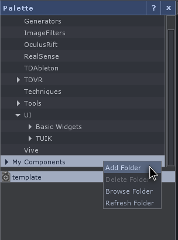
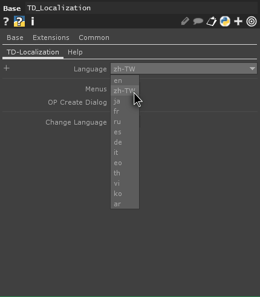
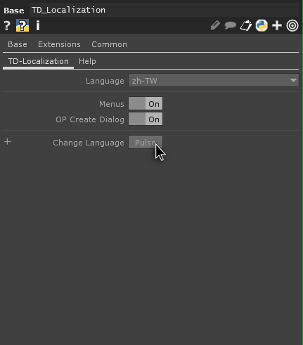
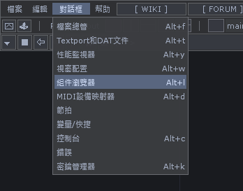
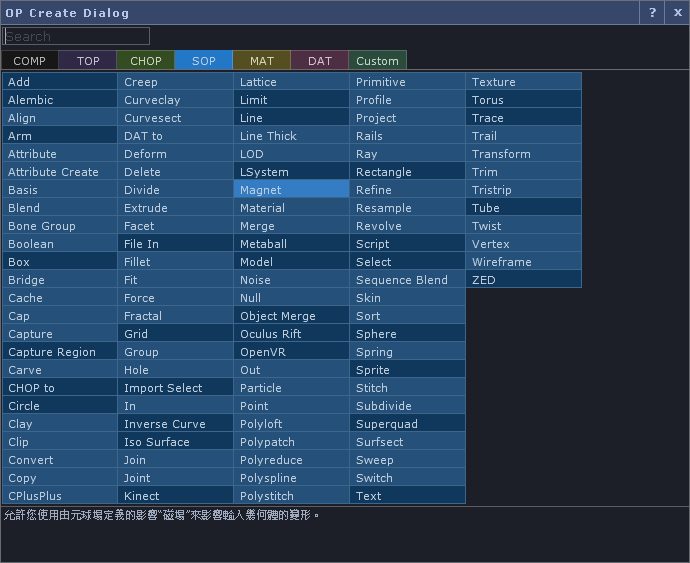
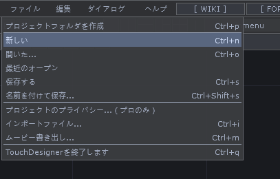
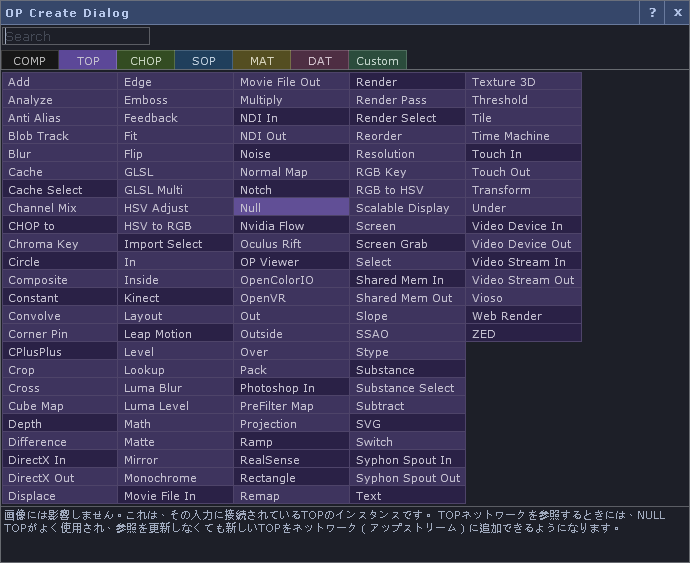

TD-Localization help
---

**[ [Englise](#english) / [繁體漢語](#繁體漢語) / [日本語](#日本語) ]**

----------
# Englise
**[ 
[Downlad latest release](https://github.com/yeataro/TD-Localization/releases/latest/download/TD_Localization.tox)
 / 
[Release page](https://github.com/yeataro/TD-Localization/releases/)
 ]**

Localize the TD user interface.

### Current function: 

- Main menu and the description of the OP Create Dialog can be translated as:

	- **Traditional Han** (Menu: All Proofing, OP Create Dialog: Google Straight + Partial Proofreading)
	- **Japanese** (Google Straight + Partial Proofreading)
	- **French** (Google straight)
	- **Russian** (Google straight)
	- **Spanish** (Google straight)
	- **German** (Google straight)
	- **Italian** (Google straight)
	- **Esperanto** (Google straight)
	- **Thai** (Google straight)
	- **Vietnamese** (Google straight)
	- **Korean** (Google straight)
	- **Arabic** (Google straight)

- A spreadsheet used in the work [here](https://docs.google.com/spreadsheets/d/1NJm6y2Eg9iyHv9mFdaBHJw_12bNU1CDQBGmgoTJVkHo/edit?usp=sharing). The editing permission is open. I will only proof the language I am familiar with. Welcome the users who are familiar with the language to proofread.
## How to use
### Add to palette
After downloading `TD_Localization.tox`, put it in `C:\Users\[username]\Documents\Derivative\Palette\[new folder]`
Or right click on `My Components` in the `Palette` panel and click `Add folder` to drag the component to the newly added folder. You can then drag components into your new project in this folder.

### Localization
Select the desired language in the drop-down menu of the `Language` parameter and switch the element you want to translate to On. Then click the `Pulse` button of `Change Language`. You will then see that your interface element has been translated into the language you want.

### Using results examples

## Tips
TD will automatically fix its own UI, each time you start TD will be restored to English interface(actually, any changes will not be stored in `/ui` , it will be re-created at startup), So every time you start, you have to translate it once.

----------

# 繁體漢語
**[ 
[下載最新版本](https://github.com/yeataro/TD-Localization/releases/latest/download/TD_Localization.tox)
 / 
[版本頁面](https://github.com/yeataro/TD-Localization/releases/)
 ]**

本地化TD使用者介面。
### 目前功能 

- 可翻譯功能表與OP Create Dialog的說明文字為：

	- **繁體漢語** (功能表:全部校對，OP Create Dialog : Google直翻+部分校對)
	- **日文** (Google直翻+部分校對)
	- **法文** (Google直翻)
	- **俄文** (Google直翻)
	- **西班牙文** (Google直翻)
	- **德文** (Google直翻)
	- **義大利文** (Google直翻)
	- **世界語** (Google直翻)
	- **泰文** (Google直翻)
	- **越南文** (Google直翻)
	- **韓文** (Google直翻)
	- **阿拉伯文** (Google直翻)

- 工作所使用的試算表[在這](https://docs.google.com/spreadsheets/d/1NJm6y2Eg9iyHv9mFdaBHJw_12bNU1CDQBGmgoTJVkHo/edit?usp=sharing)。編輯權限為開放，我只會校對我熟悉的語言，歡迎熟悉該使用語言之使用者共同校對。
## 使用方法
### 加入到調色盤中
下載 `TD_Localization.tox` 後，將它放入 `C:\Users\[使用者名稱]\Documents\Derivative\Palette\[新資料夾]` 中，
或是在 `Palette` 面板中的 `My Components` 上點擊右鍵，點擊 `Add folder`後，將組件拖拉至新增的資料夾。之後都可以在此資料夾將組件拖拉至你的新專案內。

### 本地化
在 `Language` 參數的下拉式選單中選擇想要的語言，並將想要翻譯的元素切換到On，接者點擊 `Change Language` 的 `Pulse` 按鈕。之後你會看到你的相應介面元素已翻譯成你想要的語言。

### 使用結果範例

## 使用提示
TD會自動修復它自己的UI，每次啟動TD都會復原為英語介面(實際上，任何的修改在 `/ui` 中都不會被儲存，它會重新在啟動時生成)，因此每次啟動都要翻譯一次。

---
# 日本語
**[ 
[最新リリースをダウンロードする](https://github.com/yeataro/TD-Localization/releases/latest/download/TD_Localization.tox)
 / 
[リリースページ](https://github.com/yeataro/TD-Localization/releases/)
 ]**

TDユーザーインターフェースをローカライズします。

### 現在の機能：

 - メニューとOP Create Dialogの説明は、次のように翻訳できます。

 	-  **台湾語**（メニュー：すべての校正、OP作成ダイアログ：Google直接翻訳 +部分校正）
 	-  **日本語**（Google直接翻訳 + 部分校正）
 	-  **フランス語**（Google直接翻訳）
 	-  **ロシア語**（Google直接翻訳）
 	-  **スペイン語**（Google直接翻訳）
 	-  **ドイツ語**（Google直接翻訳）
 	-  **イタリア語**（Google直接翻訳）
 	-  **エスペラント**（Google直接翻訳）
 	-  **タイ語**（Google直接翻訳）
 	-  **ベトナム語**（Google直接翻訳）
 	-  **韓国語**（Google straight）
 	-  **アラビア語**（Google直接翻訳）

 - 仕事用スプレッドシートは[こちら](https://docs.google.com/spreadsheets/d/1NJm6y2Eg9iyHv9mFdaBHJw_12bNU1CDQBGmgoTJVkHo/edit?usp=sharing)。 編集権限があります。 私は慣れ親しんだ言語だけを校正します。 その言語に精通しているユーザーを校正してください。
 

## 使い方
### パレットに追加
`TD_Localization.tox` をダウンロードしたら、それを `C：\ Users \ [ユーザー名] \ Documents \ Derivative \ Palette \ [新しいフォルダー]` に入れます
あるいは `Palette` パネルの `My Components` を右クリックし、 `Add folder` をクリックしてコンポーネントを新しく追加されたフォルダーにドラッグします。その後、このフォルダ内の新しいプロジェクトにコンポーネントをドラッグできます。

### ローカライゼーション
`Language` パラメータのドロップダウンメニューから希望の言語を選択し、翻訳したい要素をOnに切り替えてから `Change Language` の `Pulse` ボタンをクリックしてください。そうすると、あなたはあなたのインターフェース要素があなたが望む言語に翻訳されているのを見るでしょう。

### 結果の例

## ヒント
TDを起動するたびにTDは自動的に独自のUIを修正します（実際には、変更はすべて `/ui` に保存されず、起動時に再生成されます）。 起動するたびに一度翻訳してください。

----------

Author : Yea Chen <yeataro@gmail.com>
