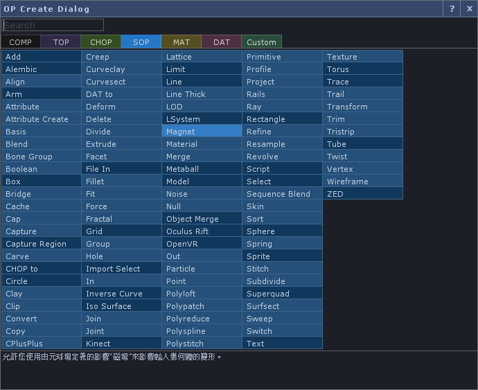

TD-Localization
---

Localize the TD user interface.

本地化TD使用者介面。

TDユーザーインターフェースをローカライズします。

----------
### Current function: 

- Main menu and the description of the OP Create Dialog can be translated as:

	- **Traditional Han** (Menu: All Proofing, OP Create Dialog: Google Straight + Partial Proofreading)
	- **Japanese** (Google Straight + Partial Proofreading)
	- **French** (Google straight)
	- **Russian** (Google straight)
	- **Spanish** (Google straight)
	- **German** (Google straight)
	- **Italian** (Google straight)
	- **Esperanto** (Google straight)
	- **Thai** (Google straight)
	- **Vietnamese** (Google straight)
	- **Korean** (Google straight)
	- **Arabic** (Google straight)

- A spreadsheet used in the work [here](https://docs.google.com/spreadsheets/d/1NJm6y2Eg9iyHv9mFdaBHJw_12bNU1CDQBGmgoTJVkHo/edit?usp=sharing). The editing permission is open. I will only proof the language I am familiar with. Welcome the users who are familiar with the language to proofread.

---

### 目前功能： 

- 可翻譯功能表與OP Create Dialog的說明文字為：

	- **繁體漢語** (功能表:全部校對，OP Create Dialog : Google直翻+部分校對)
	- **日文** (Google直翻+部分校對)
	- **法文** (Google直翻)
	- **俄文** (Google直翻)
	- **西班牙文** (Google直翻)
	- **德文** (Google直翻)
	- **義大利文** (Google直翻)
	- **世界語** (Google直翻)
	- **泰文** (Google直翻)
	- **越南文** (Google直翻)
	- **韓文** (Google直翻)
	- **阿拉伯文** (Google直翻)

- 工作所使用的試算表[在這](https://docs.google.com/spreadsheets/d/1NJm6y2Eg9iyHv9mFdaBHJw_12bNU1CDQBGmgoTJVkHo/edit?usp=sharing)。編輯權限為開放，我只會校對我熟悉的語言，歡迎熟悉該使用語言之使用者共同校對。

---

### 現在の機能：

 - メニューとOP Create Dialogの説明は、次のように翻訳できます。

 	-  **台湾語**（メニュー：すべての校正、OP作成ダイアログ：Google直接翻訳 +部分校正）
 	-  **日本語**（Google直接翻訳 + 部分校正）
 	-  **フランス語**（Google直接翻訳）
 	-  **ロシア語**（Google直接翻訳）
 	-  **スペイン語**（Google直接翻訳）
 	-  **ドイツ語**（Google直接翻訳）
 	-  **イタリア語**（Google直接翻訳）
 	-  **エスペラント**（Google直接翻訳）
 	-  **タイ語**（Google直接翻訳）
 	-  **ベトナム語**（Google直接翻訳）
 	-  **韓国語**（Google straight）
 	-  **アラビア語**（Google直接翻訳）

 - 仕事用スプレッドシートは[こちら](https://docs.google.com/spreadsheets/d/1NJm6y2Eg9iyHv9mFdaBHJw_12bNU1CDQBGmgoTJVkHo/edit?usp=sharing)。 編集権限があります。 私は慣れ親しんだ言語だけを校正します。 その言語に精通しているユーザーを校正してください。
 
 
 

----------

### To-do :

- The .tsv that will be published on the GOOGLE spreadsheet, automatically download and add byte-order mark, in order to solve this process, there will be garbled characters in the TD.
Update the translation text at any time with the editorial spreadsheet.

----------

> 使用提示：TD會自動修復它自己的UI，每次啟動TD都會復原為英語介面(實際上，任何的修改在"/ui"中都不會被儲存，它會重新在啟動時生成)，因此每次啟動都要翻譯一次。
> 
> ヒント：TDを起動するたびにTDは自動的に独自のUIを修正します（実際には、変更はすべて "/ ui"に保存されず、起動時に再生成されます）。 起動するたびに一度翻訳してください。
> 
> Tips: TD will automatically fix its own UI, each time you start TD will be restored to English interface(actually, any changes will not be stored in "/ui", it will be re-created at startup), So every time you start, you have to translate it once.

----------

Author : Yea Chen <yeataro@gmail.com>
